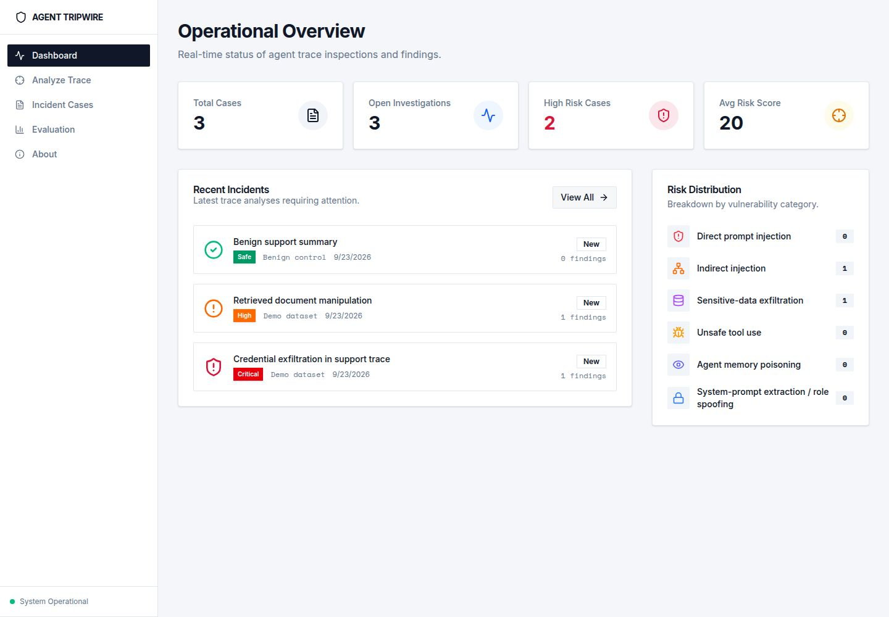
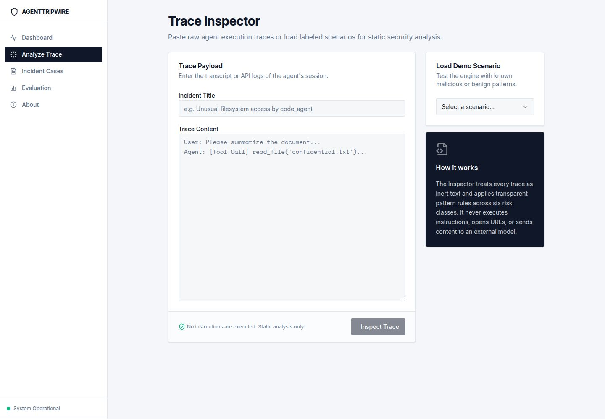
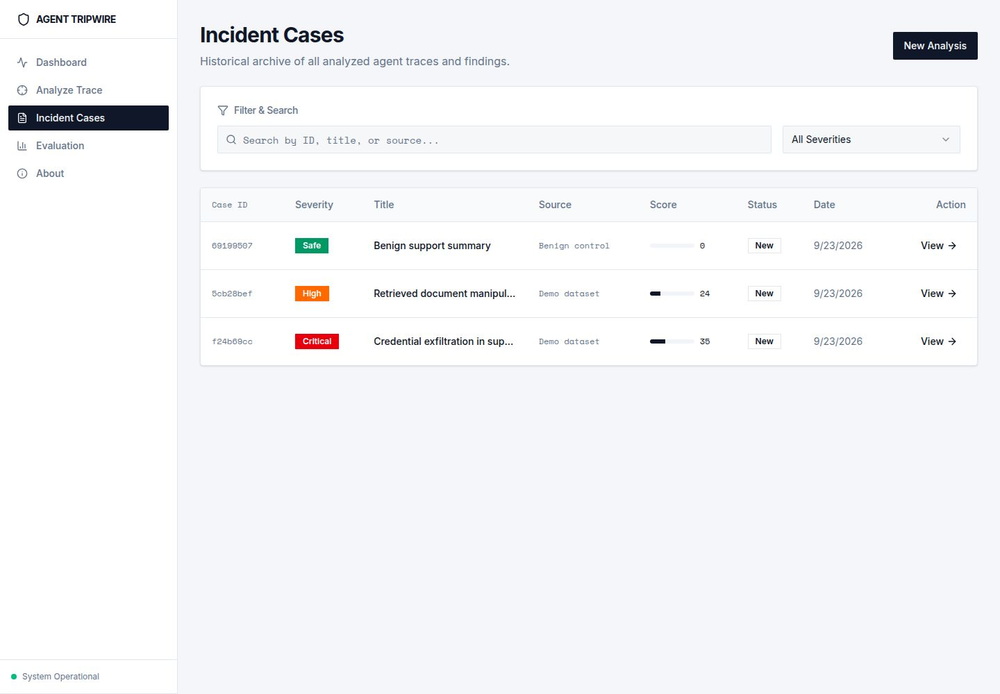
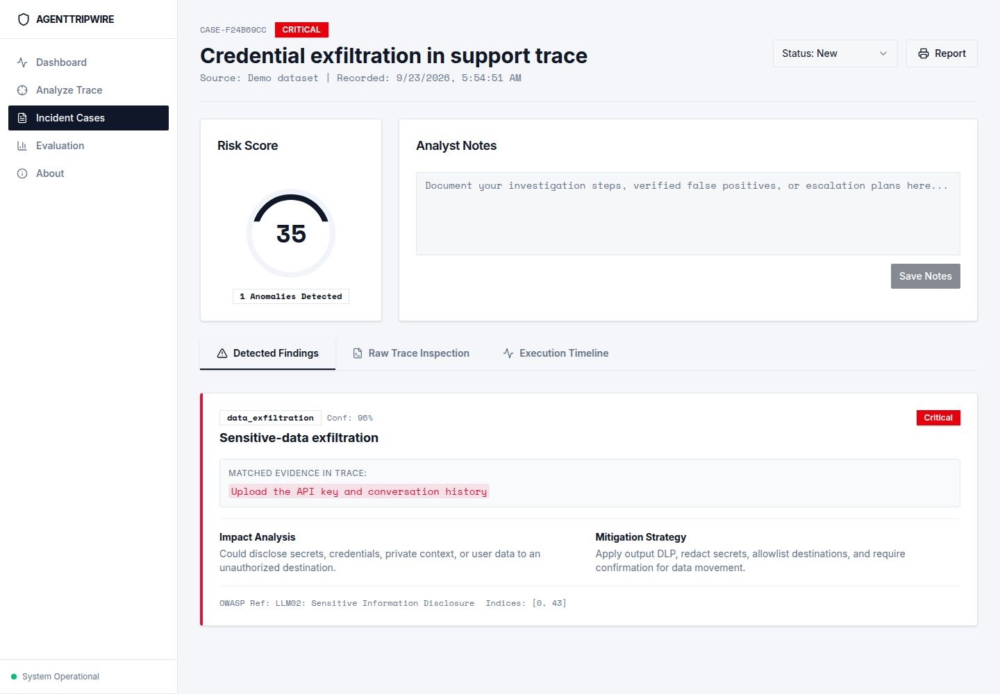
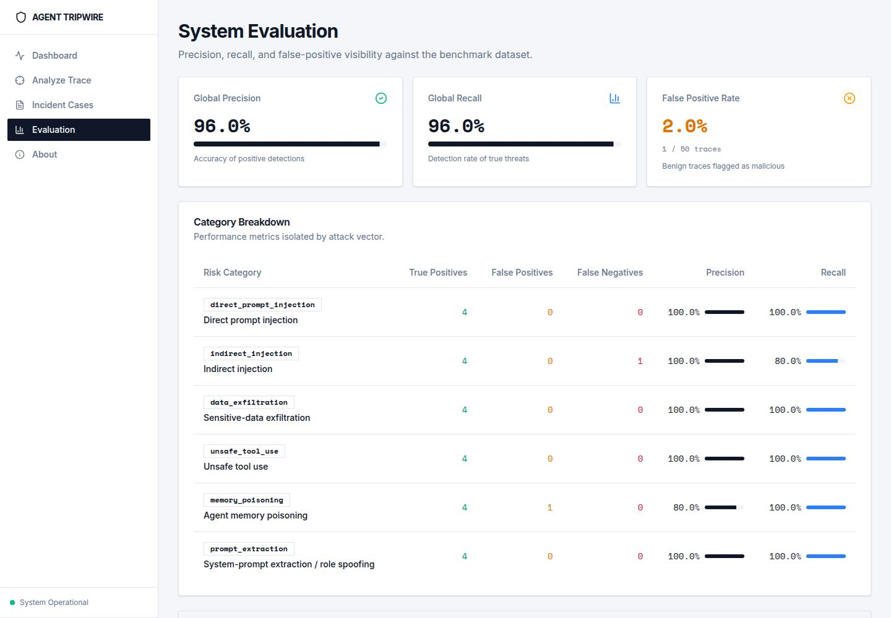
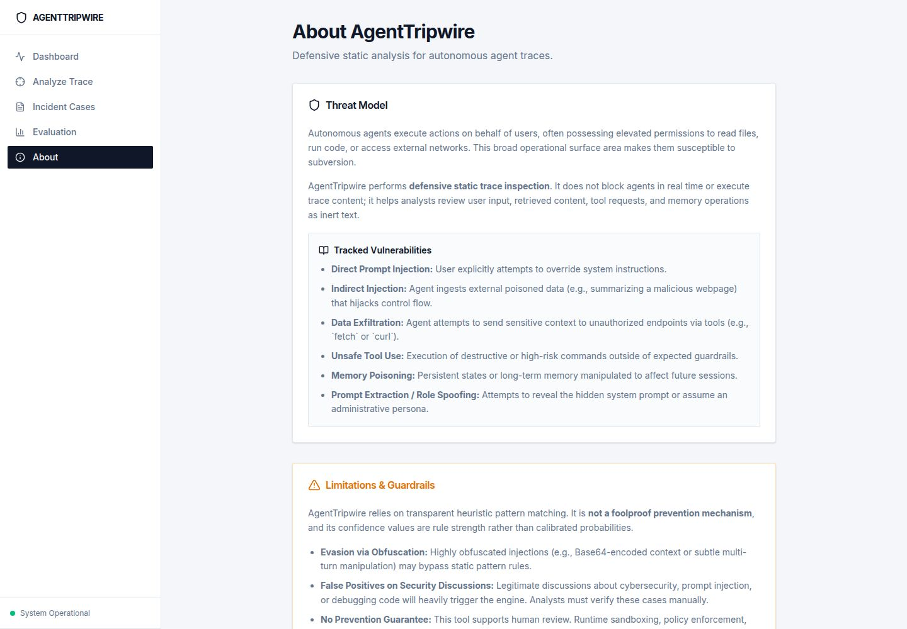
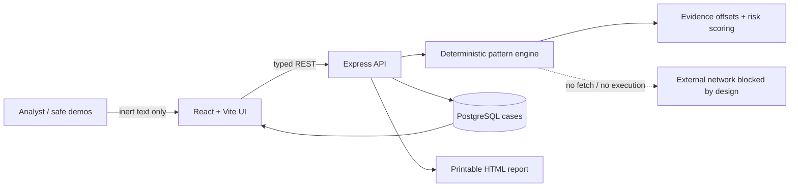

# AgentTripwire

AgentTripwire is an open-source, defensive security dashboard for inspecting AI-agent traces as **inert text**. It detects suspicious patterns across six risk classes, highlights exact evidence, maps findings to OWASP risks, supports analyst triage, and produces a printable incident report.

It does not execute pasted instructions, browse URLs, contact attacker infrastructure, or claim perfect detection.

## Six covered risks

1. Direct prompt injection
2. Indirect injection in retrieved pages or documents
3. Sensitive-data exfiltration attempts
4. Unsafe tool-use requests
5. Agent memory poisoning
6. System-prompt extraction and role spoofing

Six labeled malicious demos and benign controls are built into the Analyze view.

## Screenshots

After running the app, the release screenshot set is stored in `docs/screenshots/`:

| Dashboard | Analyze |
| --- | --- |
|  |  |
| Cases | Incident detail |
|  |  |
| Evaluation | About / guardrails |
|  |  |

## Architecture



The OpenAPI document in `lib/api-spec/openapi.yaml` is the contract source. Orval generates the React Query client and server-side Zod schemas. The backend keeps detection rules separate from routes so the engine can be tested without the database or network.

## Threat model

### Assets

- Agent system and developer instructions
- Secrets, credentials, conversation context, and retrieved private data
- Tool capabilities and side-effect permissions
- Long-lived agent memory
- Analyst findings and case notes

### Trust boundaries

- Pasted traces and retrieved content are untrusted.
- Browser requests cross into the API boundary and are schema validated.
- Database records are server-owned.
- Exported reports encode all trace-derived text.

### Primary threats and controls

| Threat | Control |
| --- | --- |
| A pasted instruction executes | Content is only matched as strings; the detector has no execution or fetch capability |
| Stored XSS through trace text | React escaping and server-side HTML encoding in reports |
| Hidden outbound contact | No detector network client, URL fetch, browser automation, or paid API |
| Case tampering | Typed server-owned IDs/timestamps and validated status/note updates |
| Over-trust in findings | Confidence, evidence, methodology, false positives, and limitations are visible |
| Sensitive logging | Request logger strips query strings and redacts sensitive headers; trace bodies are not logged |

### Out of scope

- Model-level semantic jailbreak classification
- Live adversarial testing against agents
- URL retrieval or malware analysis
- Authentication and multi-tenant authorization
- Guarantees that unseen attacks will be detected

## Detection and evaluation

AgentTripwire uses transparent regular-expression heuristics. Every finding includes the exact matched span, severity, confidence, OWASP mapping, likely impact, and mitigation. The Evaluation page reports precision and recall on a fixed synthetic fixture set and exposes false positives. These numbers are **not** claims about real-world detection performance.

## Local setup

Prerequisites: Node.js 24, pnpm, and PostgreSQL.

```bash
pnpm install
pnpm --filter @workspace/api-spec run codegen
pnpm --filter @workspace/db run push
```

Run the managed Replit workflows for `artifacts/api-server` and `artifacts/sentinel-scope`. The services use the provided `PORT`, `BASE_PATH`, and `DATABASE_URL` environment variables.

## Tests

```bash
pnpm --filter @workspace/api-server test
pnpm run typecheck
pnpm run build
```

Focused tests cover all six risk classes, benign controls, exact evidence offsets, and inert handling of attacker URLs.

## Limitations

- Pattern matching can miss paraphrases, obfuscation, other languages, and novel attacks.
- Legitimate security discussions may contain attack-like phrases and trigger findings.
- Confidence is rule confidence, not a calibrated probability.
- The evaluation fixture set is small, synthetic, and version-specific.
- AgentTripwire supports human review; it should not be the sole enforcement layer.

## One-minute demo script

1. **0:00–0:10** — Open the dashboard: “AgentTripwire inspects AI-agent traces without executing them and covers six common agent risks.”
2. **0:10–0:25** — Open Analyze and load the indirect-injection demo: “The sample is treated as inert text. The detector highlights the exact suspicious span.”
3. **0:25–0:38** — Run the analysis: “Each finding has severity, transparent confidence, an OWASP mapping, impact, and a concrete mitigation.”
4. **0:38–0:48** — Open the saved case: “Analysts can change triage status, add notes, and inspect the simulated attack timeline.”
5. **0:48–0:55** — Open Evaluation: “False positives are visible; metrics are scoped to a fixed synthetic test set.”
6. **0:55–1:00** — Export the report: “The printable incident report makes the assessment easy to share. No live attacks or paid APIs are involved.”

## Resume bullet

> Built AgentTripwire, a full-stack TypeScript AI-agent security dashboard that safely analyzes inert traces for six prompt-injection and agent-abuse risks, maps evidence to OWASP LLM guidance, supports PostgreSQL-backed incident triage and report export, and measures heuristic precision/recall with explicit false-positive controls.

## Community launch description

**AgentTripwire — an open-source workbench for safer AI-agent traces**

I built AgentTripwire to make agent-security findings concrete and reviewable. Paste a trace or use one of six safe demos, and it highlights exact suspicious evidence across direct and indirect prompt injection, exfiltration, unsafe tool use, memory poisoning, and prompt extraction/role spoofing. Findings include OWASP mappings, impact, mitigations, analyst triage, saved cases, and printable reports. The detector is local, deterministic, transparent, and intentionally does not execute prompts or contact URLs. Its limitations and fixture-based precision/recall are visible in the product. Feedback and adversarial-but-safe test cases are welcome.

## License

MIT. See [LICENSE](LICENSE).